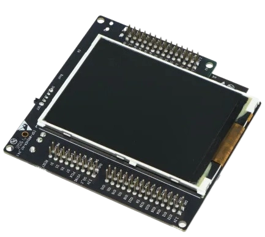
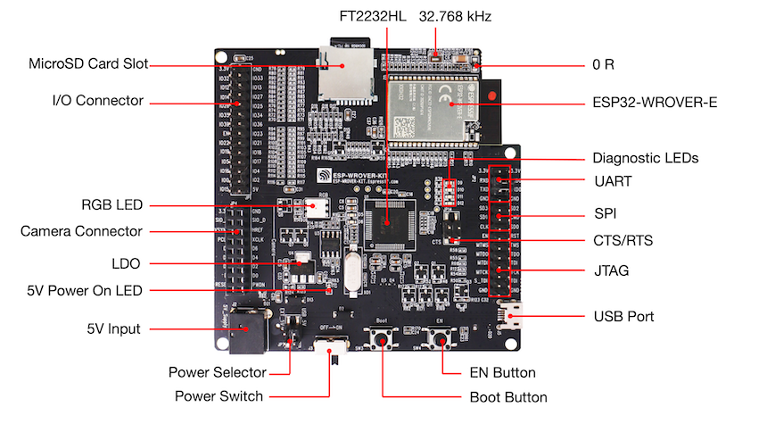

# ESP32-WROVER-KIT BSP Sample

A sample ESP-IDF application for the **ESP32-WROVER-KIT** development board that demonstrates LCD animation and RGB LED control using the [Espressif Board Support Package (BSP)](https://github.com/espressif/esp-bsp/tree/master/bsp/esp_wrover_kit).

---

## Board

|  |
|:---:|
| *ESP32-WROVER-KIT v4.1* |

|  |
|:---:|
| *ESP32-WROVER-KIT v4.1 — PCB front layout* |

---

## What This Sample Does

The application runs two concurrent FreeRTOS tasks:

- **LCD animation** — Decodes a JPEG image and renders an animated effect on the on-board 320×240 ILI9341/ST7789V LCD at up to 30 FPS. Pixel buffers can be placed in PSRAM or internal RAM (controlled by the `LCD_BUFFER_IN_PSRAM` Kconfig option).
- **RGB LED cycling** — Cycles through the on-board RGB LED colours (red, green, blue) at 100 ms intervals.

All hardware initialization (SPI LCD, backlight PWM, GPIO LEDs) is handled by the BSP, keeping application code free of low-level board details.

---

## Requirements

| Item | Details |
|------|---------|
| Target | ESP32 |
| ESP-IDF | >= 5.2 |
| BSP | `espressif/esp_wrover_kit` v2.0.2 |
| Flash | 4 MB |

---

## Build and Flash

```bash
idf.py set-target esp32
idf.py build
idf.py -p <PORT> flash monitor
```

Press `Ctrl-]` to exit the serial monitor.

---

## Project Structure

```
.
├── components/
│   └── esp_wrover_kit_bsp/     # Local BSP component (wraps espressif/esp_wrover_kit)
├── main/
│   ├── main.c                  # Application entry point
│   ├── pretty_effect.c/.h      # LCD animation effect
│   ├── decode_image.c/.h       # JPEG decoder helper
│   └── image.jpg               # Source image for the animation
└── sdkconfig.defaults          # Default SDK configuration (4 MB flash)
```

---

## Links

| Resource | URL |
|----------|-----|
| Sample LCD app (ESP-IDF) | [esp-idf/examples/peripherals/spi_master/lcd - ESP-IDF Sample](https://github.com/espressif/esp-idf/tree/v5.3/examples/peripherals/spi_master/lcd) |
| WROVER-KIT BSP on ESP Component Registry | [espressif/esp_wrover_kit — ESP Component Registry](https://components.espressif.com/components/espressif/esp_wrover_kit) |
| WROVER-KIT Getting Started | [ESP-WROVER-KIT v4.1 Getting Started Guide — esp-dev-kits](https://docs.espressif.com/projects/esp-dev-kits/en/latest/esp32/esp-wrover-kit/user_guide.html) |
| BSP GitHub repository | [espressif/esp-bsp/bsp/esp_wrover_kit — Board support components for Espressif development boards](https://github.com/espressif/esp-bsp/tree/master/bsp/esp_wrover_kit) |
